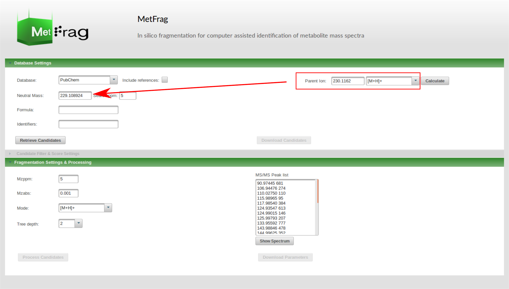
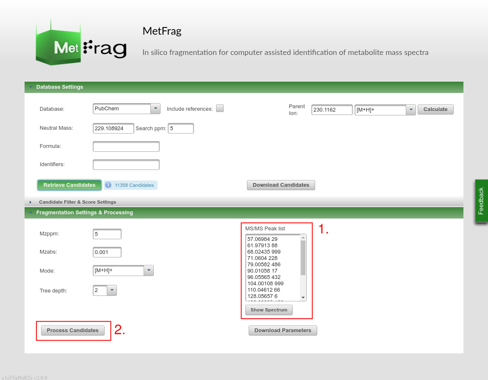
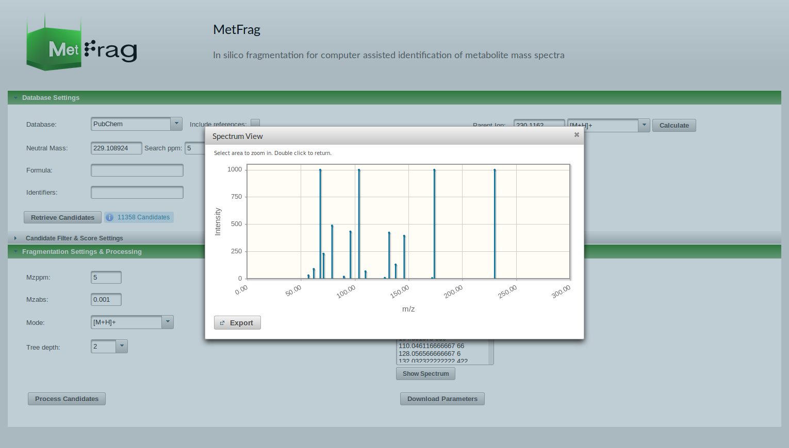

c-ruttkies# MetFrag Hands-on

**Topic:** Using MetFrag for compound identification with MS/MS data and additional information.

A online training presentation is avalable [here](https://c-ruttkies.github.io/MetFragTraining/).

---

In this hands-on session you will learn how to use MetFrag to annotate MS/MS spectra as a first 
step to identify a molecular structure given MS and MS/MS information. Furthermore, we will use
additional experimental and meta data to support a putative identification.

---

## MetFrag webservice workflow

In this example we have extracted a feature from a water (river) sample from a LC-MS/MS measurement
with a precursor m/z&nbsp;230.1162 at retention time 10.1&nbsp;minutes. The data is acquired on a
LTQ Orbitrap XL with a high mass accuracy (&lt;5ppm) in positive ion mode. The adduct type of the 
selected precursor ion is known as \[M+H\]⁺.

Please download the prepared data:

* MS1: <a href="metfrag_handson_data/ms1_mz230.1162_rt10.1.txt" download>ms1_mz230.1162_rt10.1.txt</a>
* MS2: <a href="metfrag_handson_data/ms2_mz230.1162_rt10.1.txt" download>ms2_mz230.1162_rt10.1.txt</a>

---

## *Step 1 - Run initial MetFrag processing*

### 1 a) Retrieve Candidates from database
- visit the MetFragWeb tool in your browser 
<a href="http://msbi.ipb-halle.de/MetFragBeta" target="_blank">http://msbi.ipb-halle.de/MetFragBeta</a>
- define database settings to retrieve candidates given the MS1 information:
	1. use the precursor m/z value and type to calculate the neutral monoisotopic mass
	2. check mass accuracy
	3. select PubChem as compound database
- start a candidate retrieval by clicking "Retrieve Candidates"

---

<video controls preload> 
    <source src="media/cast1.webm"></source> 
    

         
          
         
    

</video>

---

- MetFrag searches candidates matching the information given by the “Database settings” (here: Neutral Mass and 5 ppm deviation)
- after the retrieval you can download the candidate list as CSV or XLS to get a first overview about the retrieved data set

---

#### 1 b) Process candidates by performing *in silico* fragmentation and matching to MS/MS data

- use the "Fragmentation settings" tab to add the given MS2 peak list
- you can visualize the peak list by clicking on the "Show Spectrum" button
- keep the settings for the *in silico* fragmentation and start the processing by clicking “Process Candidates”

---

<video controls preload>
    <source src="media/cast2.webm"></source>
    

         
          
         
	  
	 
    

</video>

---

- MetFrag now generates fragments for each candidate up to the specified tree depth
- the fragments are mapped to the MS/MS peak list (based on mass) which is used to calculate a score for each candidate
- after the processing is finished you see the ranked candidates list in the “Results” tab
- here you have different possibilities:
    - you can filter candidates by explained peaks
    - investigate explained fragments and calculated scores for each candidate
    - download ranked candidate list as CSV or XLS file

---

**Questions:**

Q1: How many different molecular formulas are present?

Q2: What do you think is the correct molecular formula? What else could you do to verify that besides the given MetFrag results?

### *Step 2 - Run MetFrag processing using molecular formula*

*2 a) Retrieve Candidates from database*

-   use the same settings as in 1 a) but add the molecular formula

-   select “Include references” when using PubChem

*2 b) Process candidates by performing *in silico* fragmentation and matching to MS/MS data*

-   use the same settings as in 1 b) and process the candidates

**Questions:**

Q3: Looking at the results, what has changed compared to using the monoisotopic mass as candidate filter?

Q4: Is the molecular formula helpful here?

### *Step 3 - Run MetFrag adding additional experimental information*

*3 a) Add the retention time data model to the MetFragWeb tool*

-   adding additional information available from the experimental context is oftentimes helpful to verify a putative identification

-   now we want to add retention time as additional experimental information

-   there exist different models to predict retention times

-   MetFrag includes a linear model that is usually based on a [*logP*](https://en.wikipedia.org/wiki/Partition_coefficient) partition

coefficient - retention time correlation

-   the file retentiontime\_model/rt\_input\_PubChem\_XlogPs.csv contains a data set of measured retention times and [*XLogP3*](https://www.ncbi.nlm.nih.gov/pubmed/17985865) values of 254 Eawag standards:

-   upload the data set to the MetFragWeb tool in the “Candidate Filter & Score Settings” tab using the “Retention Time” panel on the right side

-   after the file upload set the retention time of the precursor and select XLogP3 as partition coefficient which is used for correlation

-   this results in an additional scoring term in the scoring function of MetFrag

*3 b) Process candidates by performing *in silico* fragmentation and matching to MS/MS data*

-   use the same settings as in 2 b) and process the candidates

**Questions:**

Q5: What has changed compared to the previous run?

Q6: Use the weight sliders in the “Results” tab. Does it change anything?

Q7: Is the retention time information helpful here?

### *Step 4 - Run MetFrag adding additional meta information*

*4 a) Add the additional scoring terms*

-   meta information can help to verify putative identifications depending on the experimental context

-   however, you need to be careful when using this information which is not related to your acquired data

-   in the “Candidate Filter & Score Settings” tab select the additional “Database Scoring Terms”

    -   PubChemNumberPubMedReferences

    -   PubChemNumberPatents

*4 b) Process candidates by performing *in silico* fragmentation and matching to MS/MS data*

-   use the same settings as in 3 b) and process the candidates

**Questions:**

Q8: What has changed compared to the previous run?

Q9: Would the number of references and patents have helped for a metabolomics experiment?

Q10: Investigate the high intensity fragments of the first ranked candidate. Are they plausible compared to fragment structures of other candidates?

### *Step 5 - Search in spectral libraries*

*5 a) Investigate MS/MS peaks in MassBank*

-   visit MassBank EU (http://www.massbank.eu)

-   select the “Peak Search” and add the most intense explained peaks

-   hitting the “Search” button MassBank searches for spectra with matching peaks in the database

**Questions:**

Q11: Investigate the results and compare them to your MetFrag result list. Any conclusions?

### *Step 6 - Combine Spectra library search and MetFrag*

*6 a) Enable spectral similarity in MetFrag*

-   in the “Candidate Filter & Score Settings” tab enable “Spectral Similarity”

-   MetFrag will now query the MS/MS peak list against a spectral library mirror to search for similar spectra of known compounds

*6 b) Process candidates by performing *in silico* fragmentation and matching to MS/MS data*

-   use the same settings as in 4 b) and process the candidates

**Questions:**

Q12: Discard the meta information scores to just use the results based on experimental data. Any conclusions?
